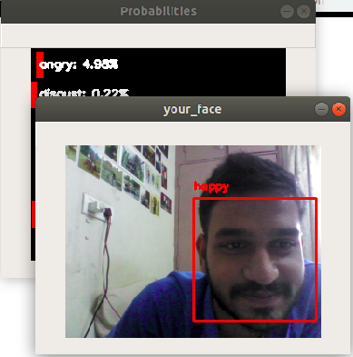
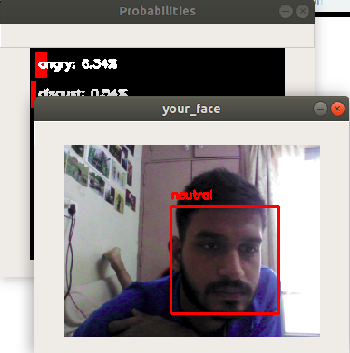

# Project Name : Emotion-recognition
# Table of Content :
1.[Description](#Description)

2.[Installations](#Installations)

3.[Usage](#Usage)

4.[Dataset](#Dataset)

# Description

Our Human face is having a mixed emotions so we are to demonstrate the probabilities of these emotions that we have.

## What does Emotion Recognition mean?

Emotion recognition is a technique used in software that allows a program to "read" the emotions on a human face using advanced image processing. Companies have been experimenting with combining sophisticated algorithms with image processing techniques that have emerged in the past ten years to understand more about what an image or a video of a person's face tells us about how he/she is feeling and not just that but also showing the probabilities of mixed emotions a face could has.

# Installations
-keras

-imutils

-cv2

-numpy
 
 Install using requirements.txt
 
 `pip install -r requirements.txt`
 
 
# Usage

The program will create a window to display the scene capture by webcamera and a window representing the probabilities of detected emotions.

> Demo

`python real_time_video.py`

You can just use this with the provided pretrained model i have included in the path written in the code file, i have choosen this specificaly since it scores the best accuracy, feel free to choose any but in this case you have to run the later file train_emotion_classifier.

> If you just want to run this demo, the following content can be skipped

Train

`python train_emotion_classifier.py`

# Dataset

I have used [this](https://www.kaggle.com/c/3364/download-all) dataset

Download it and put the csv in fer2013/fer2013/

-fer2013 emotion classification test accuracy: 66%

# Credits
This work is inspired from [this](https://github.com/oarriaga/face_classification) great work and the resources of Adrian Rosebrock helped me alot!.

# Ongoing 
Draw emotions faces next to the detected face.

# Issues & Suggestions

If any issues and suggestions to me, you can create an [issue](https://github.com/bhrt-sharma/Emotion-Detection/issues).

>If you like this work please help me by giving me *some stars*.
